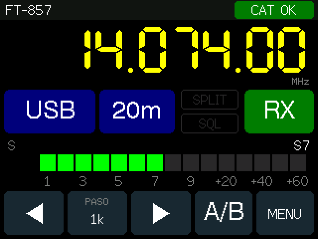

# ea5agt-FT857-CAT

Display táctil por CAT para los Yaesu **FT-817 / FT-818 / FT-857 / FT-897** con la placa
**ESP32-2432S028R** («Cheap Yellow Display», ESP32 + pantalla ILI9341 de 2,8" 320×240 + táctil XPT2046).

**Instalar el firmware desde el navegador:** https://rampa069.github.io/ea5agt-FT857-CAT/
(Chrome o Edge en un ordenador, placa conectada por USB).



## Qué hace

- Muestra frecuencia, modo (con filtro estrecho del 857), banda, S-meter, potencia, SWR alta, split y squelch.
- Desde la pantalla táctil: modo, banda (recuerda la última frecuencia y modo de cada banda), frecuencia por
  teclado, sintonía con paso de 10 Hz a 1 MHz (mantener pulsado repite), VFO A/B, split, clarificador,
  desplazamiento de repetidor y tonos CTCSS/DCS en FM, bloqueo.
- Conexión con la radio **por cable** (UART a 3,3 V en IO27/IO22, necesita adaptador de nivel) o
  **por Bluetooth** con un adaptador CAT tipo HC-05/HC-06 (pantalla de búsqueda, PIN y reconexión automática).
- Ajustes guardados en la placa: modelo, baudios, enlace, brillo, calibración del táctil, adaptador Bluetooth.
- **Nunca transmite**: no envía PTT ni escribe en la EEPROM de la radio.

## Conexión con la radio

| | Cable | Bluetooth |
|---|---|---|
| Conector | ACC (817/818) o CAT/LINEAR (857/897), mini-DIN 8 | El mismo, con el adaptador BT enchufado |
| Niveles | Radio a 5 V TTL, ESP32 a 3,3 V: **hace falta adaptador de nivel** | El adaptador ya los convierte |
| Velocidad | Ajustes → Baudios = menú CAT RATE de la radio | CAT RATE de la radio = la del adaptador (normalmente 9600) |
| Pines CYD | CN1: IO27 = RX (desde la radio), IO22 = TX (hacia la radio), GND | — |

En el FT-857 el menú 020 debe estar en **CAT**. Formato serie 8N2 (el HC-06 envía 8N1; la radio lo acepta).

Protocolo: tramas de 5 bytes `[P1 P2 P3 P4 OPCODE]`. Lectura continua de `03` (frecuencia y modo),
`E7` (estado RX) y `F7` (estado TX). Tabla completa de comandos en [docs/ui.md](docs/ui.md).

## Compilar

Con [PlatformIO](https://platformio.org/):

```bash
pio run -e cyd -t upload            # placa con un micro-USB (ILI9341)
pio run -e cyd2usb -t upload        # placa con micro-USB + USB-C (ST7789, sin probar)
pio run -e cyd-usbcat -t upload     # pruebas: CAT por el USB, para el simulador
pio run -e touchtest -t upload -t monitor   # calibración del táctil por consola
```

Si la subida falla con `Invalid head of packet`, el CH340 no aguanta 921600: ya está a 460800 en `platformio.ini`.

## Probar sin radio

- **Tests**: `pio test -e native` (protocolo, sondeo, lógica de la interfaz, táctil) y
  `python3 -m unittest discover -s tools` (simulador).
- **Simulador de radio** ([tools/ft8x7_sim.py](tools/README.md)): responde como un FT-817/857 por un puerto serie,
  un pseudo-terminal (`--pty`) o, en Linux, como adaptador Bluetooth (`--rfcomm 1`).
  Con el firmware `cyd-usbcat`: `python3 tools/ft8x7_sim.py /dev/cu.usbserial-XXXX --static -v`.
- **Capturas de la interfaz sin placa**: `tools/screenshot/render.sh` compila la interfaz real en el ordenador,
  simula toques y guarda PNG de cada pantalla.
- **Maqueta interactiva**: [docs/ui/mockup.html](docs/ui/mockup.html).

## Estructura

```
lib/Ft8x7Cat   Protocolo CAT, cliente, sondeo con cola de escrituras, puerto conmutable (sin Arduino)
lib/RigUi      Lógica de interfaz: bandas, sintonía, teclado, táctil, ajustes (sin Arduino)
src/ui         Pantallas (TFT_eSPI) y tema de colores
src/bt         Enlace Bluetooth SPP como maestro
src/main.cpp   Tarea CAT (núcleo 0), interfaz (núcleo 1), NVS, brillo
tools/         Simulador, renderizador de capturas, preparación de la web
web/           Página de instalación (ESP Web Tools), publicada por GitHub Actions
docs/          Diseño de la interfaz y maqueta
```

## Referencias

- Manual del FT-817 (CAT, págs. 70-73) y del FT-857D.
- [KA7OEI: CAT del FT-817](http://www.ka7oei.com/ft817_meow.html).
- Hamlib, `rigs/yaesu/ft817.c` y `ft857.c`.
- [YO3GGX: adaptador CAT Bluetooth DIY](https://www.yo3ggx.ro/btcat/FT8x7_DIY_Bluetootth_CAT_interface_v1.pdf).

## Licencia

[GPL-3.0](LICENSE).
